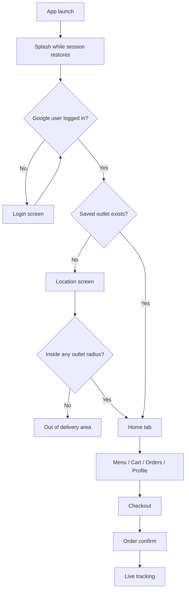

# Brisko Pizza App — Complete Working Guide

Brisko Pizza is a Flutter food-ordering app for hot, fresh pizza delivery. Tagline: **Hot. Fresh. Fast.**

This document covers how the app works, every user-facing feature, screen layout, visual design system, and theme tokens.

---

## 1. What the app is

A customer-facing pizza delivery app where a signed-in user:

1. Picks a delivery location
2. Gets matched to the nearest outlet in service radius
3. Browses outlet-specific menu
4. Customizes pizzas (size, crust, toppings, addons)
5. Applies coupons / loyalty points
6. Places a Cash on Delivery order
7. Tracks live order status
8. Reorders, rates, and manages profile

Backend is **Firebase** (Auth + Realtime Database + Messaging). State is **Riverpod**. Navigation is **go_router**.

---

## 2. Tech stack

| Layer | Choice |
|---|---|
| Framework | Flutter (Dart SDK ^3.11.1) |
| State | flutter_riverpod |
| Routing | go_router (StatefulShellRoute for tabs) |
| Auth | Firebase Auth + Google Sign-In |
| Database | Firebase Realtime Database (offline persistence on) |
| Push | Firebase Messaging + in-app notification list |
| Location | geolocator + geocoding + haversine matching |
| Images | cached_network_image |
| Fonts | Google Fonts — Poppins (headings) + Inter (body) |
| Local cache | shared_preferences (session + last location) |

Package name: `brisko`  
Version: `1.0.0+1`  
App title: `Brisko Pizza`

---

## 3. App flow (how it actually works)



Redirect rules (`lib/app.dart`):

- Session restore / location restore in progress → stay on `/` splash
- No Firebase user → `/login`
- Logged in + no outlet → `/location` (except `/addresses`)
- Logged in + outlet + on `/` or `/login` → `/home`

---

## 4. Features in detail

### 4.1 Authentication

- **Continue with Google** is the only login method
- App never sees the Google password
- On first login a `users/{uid}` record is created: name, email, empty phone, createdAt
- Session is restored from Firebase Auth; web uses `Persistence.LOCAL`
- Logout signs out Google + Firebase and clears the local logged-in flag
- Profile can later add optional phone and edit name/email

### 4.2 Splash

- Black full-screen with Brisko logo, app name, and tagline
- Fade + scale animation (~900ms)
- Router holds splash until auth + location restore finish

### 4.3 Delivery location and outlet matching

- Detect GPS (`Detect my location`) or enter address + lat/lng
- Demo shortcut: Connaught Place, New Delhi (`28.6328, 77.2197`)
- App loads active outlets from Firebase
- Haversine distance vs each outlet `serviceRadiusKm` (seeded as 25 km)
- Nearest matching outlet is assigned
- If none match → **Out of delivery area** (home also shows this empty state)
- Chosen address + outlet are persisted in SharedPreferences and restored on next launch
- Saved addresses can be tapped to switch location/outlet

Seeded outlets:

- Brisko Connaught Place, New Delhi
- Brisko Bandra, Mumbai

Hours (seed): 11:00 – 23:30

### 4.4 Home

Black rounded header with:

- Logo + **Brisko Pizza** + tagline
- Notification bell with unread badge
- Tappable current address row
- Search field (`Search pizzas, burgers, sides...`)

Below header:

- Promo PageView banners (free delivery, BRISKO50, loyalty)
- Horizontal category chips
- Best Sellers row
- Featured row
- Search results as 2-column grid
- Products are filtered to the selected outlet

### 4.5 Menu

- Horizontal category chips (Pizzas, Burgers, Sides, Beverages, Combos, Offers)
- Veg / Non-veg / All filter pills
- 2-column product grid for current outlet + category
- Home can deep-link via `/menu?cat={id}`

### 4.6 Product detail and customization

Product page:

- Full-width image app bar
- Veg/non-veg badge, name, description, rating, price
- Wishlist heart
- Last 5 reviews
- Sticky CTA: **Add to cart** or **Customize & add**

Customize bottom sheet (pizzas):

- Size: Regular (0) / Medium (+80) / Large (+160)
- Crust: Classic (0) / Thin (+30) / Cheese Burst (+70)
- Toppings: mushroom, olives, jalapeno, paneer, chicken, pepperoni
- Addons: extra cheese, garlic dip
- Quantity stepper
- Live unit price = base + size + crust + toppings + addons
- Adds a unique cart line (UUID) so two customizations do not merge

### 4.7 Cart

- Empty state → Browse menu
- Line items: image, name, size/crust, price, quantity, remove
- Coupon code field + Apply
- Price breakdown: Subtotal, GST 5%, Delivery, Coupon, Loyalty, Total
- Sticky **Proceed to Checkout · Rs X**

Pricing rules:

- GST = 5% of subtotal
- Delivery = Rs 40, **FREE if subtotal >= Rs 499**
- Coupon: flat or percent, min order, max cap, validity window, first-order-only, per-user usage limit
- Loyalty redemption optional at checkout

Seeded coupons:

| Code | Offer |
|---|---|
| BRISKO50 | Flat Rs 50 off above Rs 299 |
| FIRST100 | Rs 100 off first order above Rs 399 |
| PIZZA20 | 20% off up to Rs 120, min Rs 249 |

### 4.8 Checkout and payment

- Delivery address (switch from saved list)
- Loyalty redeem toggle (needs min points, default 50)
- Payment: **Cash on Delivery** (live) / **Online** (coming soon)
- Optional order notes
- Place Order writes to Firebase:
  - `orders/{orderId}`
  - `userOrders/{uid}/{orderId}`
  - `outletOrders/{outletId}/{orderId}`
- Cart is cleared, coupon and loyalty toggle reset
- Online payment currently returns “coming soon” and does not place the order

Order id format: `ORD{timestamp}`

### 4.9 Order confirmation

Cream screen with green check, order id, **Track order**, **Back to home**.

### 4.10 Orders list

- Realtime list from `userOrders` + `orders/{id}`
- Newest first
- Card: pizza icon, first item name, date/time, status chip, amount
- Tap → tracking screen

### 4.11 Order tracking

Live status stepper:

1. Placed
2. Confirmed
3. Preparing
4. Ready
5. On the way
6. Delivered

Also shows:

- Amount, payment method, payment status
- Delivery address
- Item list + invoice link (opens when `invoiceUrl` exists)
- **Cancel order** only while `placed` or `confirmed`
- **Reorder** copies items into cart and goes to `/cart`
- **Rate & review** after delivered (reviews first product with a valid `productId`)

Cancelled orders show a cancel banner instead of the stepper.

### 4.12 Reviews

- Bottom sheet: 1–5 stars + comment
- Saved at `reviews/{productId}/{uid}`
- Product `avgRating` and `reviewCount` are recalculated after submit

### 4.13 Wishlist

- Heart on product detail toggles `users/{uid}/wishlist`
- Grid of saved products
- Empty: “Tap the heart on a pizza to save it.”

### 4.14 Addresses

- CRUD saved addresses (label, full address, lat/lng)
- Default badge
- Tap an address to set it as current delivery location
- FAB to add
- Menu: Edit / Set default / Delete

### 4.15 Loyalty

Default config (Firebase `loyaltyConfig`):

- Earn **0.05 pts per rupee**
- 1 point = Rs 1
- Min redeem **50**
- Max **200** points per order
- Expiry **90 days** (config field)
- Min order value to earn points **0** (orders below it earn nothing; `minOrderValueForPoints`)

Screen: black balance card + earn/redeem history. Points credit on delivered orders.

### 4.16 Offers

Lists active coupons with code, description, min order, **Copy** to clipboard.

### 4.17 Notifications

- In-app list from Firebase
- Unread cards use cream background
- Tap marks read and opens related order if `orderId` is set
- Home bell shows unread count

### 4.18 Support

- WhatsApp chat (`wa.me`)
- Call support number
- Raise ticket: complaint / query / feedback → `supportTickets/{id}` with status `open`

### 4.19 Profile

- Avatar initial, name, email, phone, loyalty pts
- Edit dialog for name / email / phone
- Links: Addresses, Wishlist, Loyalty, Offers, Notifications, Support, Policies
- Logout confirmation dialog

### 4.20 Policies

- Privacy Policy
- Terms & Conditions
- Refund & Cancellation (cancel only while Placed/Confirmed)

---

## 5. Navigation map

### Bottom tabs (StatefulShellRoute)

| Index | Route | Label | Icon |
|---|---|---|---|
| 0 | `/home` | Home | home |
| 1 | `/menu` | Menu | local_pizza |
| 2 | `/cart` | Cart | shopping_bag (qty badge) |
| 3 | `/orders` | Orders | receipt_long |
| 4 | `/profile` | Profile | person |

Tab bar is black. Selected item is Brisko red with a short red underline. Unselected is `#BBBBBB`.

### Stack routes

| Path | Screen |
|---|---|
| `/` | Splash |
| `/login` | Google login |
| `/location` | Delivery location |
| `/product/:id` | Product detail |
| `/checkout` | Checkout |
| `/order-confirm/:id` | Success |
| `/order/:id` | Tracking |
| `/addresses` | Saved addresses |
| `/wishlist` | Wishlist |
| `/loyalty` | Loyalty |
| `/offers` | Offers |
| `/notifications` | Notifications |
| `/support` | Support |
| `/policies` | Policies |

---

## 6. Layout structure

### Folder layout

```text
lib/
  main.dart                 Firebase init + seed + ProviderScope
  app.dart                  GoRouter + MaterialApp.router
  firebase_options.dart
  core/
    constants/              colors, strings, api
    theme/                  AppTheme.light
    utils/                  pricing, formatters, geo, phone
    widgets/                shared UI
    services/               firebase, seed, location, payment, otp, notifications
  features/
    onboarding/
    auth/
    location/
    home/                   shell + home
    menu/
    product_detail/
    cart/
    checkout/
    orders/
    order_tracking/
    reviews/
    addresses/
    wishlist/
    loyalty/
    offers_coupons/
    notifications/
    support/
    profile/
```

Feature folders typically hold: `*_screen.dart`, `*_controller.dart`, `*_model.dart`.

### Screen layout patterns

**Standard inner page**

- Black AppBar, left-aligned title, white icons
- Grey scaffold (`#F6F4F2`)
- `ListView` / `GridView` with 16px padding
- Content in 16px-radius white cards

**Home**

- `CustomScrollView` slivers
- Black header with 24px bottom radius
- Banners, then horizontal lists, then grids

**Cart / Checkout / Product detail**

- Scrollable body
- White sticky bottom bar with shadow
- Full-width primary button (52px height)

**Empty / loading**

- `EmptyState` centered icon + title + subtitle + optional CTA
- `PizzaLoader` for orders/tracking
- Skeleton cards while catalog loads

**Sheets / dialogs**

- Bottom sheets: 24px top radius, 40x4 grab handle
- Dialogs: 20px radius, Poppins title

### Shared widgets

| Widget | Role |
|---|---|
| `AppCard` | White 16-radius card, light border, soft shadow |
| `PrimaryButton` | Full-width red CTA, 52px, optional loading spinner |
| `ProductCard` | Image, BEST badge, veg mark, name, price, add |
| `QuantityStepper` | +/- quantity |
| `PriceRow` | Label / value billing line |
| `StatusChip` | Colored order-status pill |
| `VegBadge` | Green/red square-dot food mark |
| `SectionHeader` | Title + See all |
| `EmptyState` | Friendly empty UI |
| `Skeleton` / `ProductCardSkeleton` | Loading placeholders |
| `BriskoLogo` | PNG logo with pizza-slice fallback painter |
| `PizzaLoader` | Branded loading |
| `CategoryIcon` | Category glyph |

---

## 7. Design system

### Visual identity

Food-delivery look: **black + Brisko red + warm cream/grey**. High contrast, rounded, card-based, no heavy elevation.

Mood: premium QSR — hot pizza, fast delivery, clean billing.

### Color palette (`lib/core/constants/app_colors.dart`)

| Token | Hex | Use |
|---|---|---|
| primary | `#E30613` | Brand red, CTAs, prices, selected tab, BEST badge |
| primaryDark | `#B10510` | Error text on soft red |
| primarySoft | `#FFE8EA` | Soft red fills (icons, cancel, error box) |
| black | `#111111` | AppBars, tab bar, splash, loyalty card, header |
| white | `#FFFFFF` | Cards, buttons on dark, surfaces |
| grey | `#F6F4F2` | Scaffold background |
| cream | `#FFF8F3` | Login, order confirm, unread notifications, tile icons |
| success | `#2E7D32` | Delivered, free delivery, applied coupon |
| successSoft | `#E8F5E9` | Success fills |
| warning | `#F5A623` | Stars, preparing/ready chips |
| warningSoft | `#FFF4E0` | Warning fills |
| text | `#111111` | Body/headings |
| muted | `#6B6B6B` | Secondary copy |
| border | `#E8E4E0` | Inputs, cards, chips |
| veg | `#2E7D32` | Veg badge |
| nonVeg | `#E30613` | Non-veg badge |
| overlay | `#99000000` | Dim overlay |
| shadow | `#14000000` | Card / sticky-bar shadow |

Status chip mapping:

- delivered → green
- cancelled → red
- preparing / ready → amber
- out_for_delivery → blue (`#E3F2FD` / `#1565C0`)
- other (placed, confirmed) → grey/black

### Typography

Material 3 + Google Fonts.

- **Poppins**: display, headlines, titles, button labels, AppBar
- **Inter**: body, hints, labels, snackbars

Scale:

| Style | Font | Size | Weight |
|---|---|---|---|
| displayLarge | Poppins | 32 | 800 |
| headlineLarge | Poppins | 26 | 700 |
| headlineMedium | Poppins | 22 | 700 |
| titleLarge | Poppins | 18 | 700 |
| titleMedium | Poppins | 16 | 600 |
| bodyLarge | Inter | 16 / 1.5 | 400 |
| bodyMedium | Inter | 14 / 1.5 | 400 |
| labelLarge | Poppins | 14 | 600 |
| AppBar title | Poppins | 18 | 700 |
| Primary button | Poppins | 16 | 700 |
| Price emphasis | — | — | 800, primary red |

Currency is formatted as Indian rupees (`rupees()` helper).

### Shape and spacing

| Element | Radius / size |
|---|---|
| Cards / product cards | 16 |
| Buttons / inputs | 14 |
| Chips / status pills | 20 |
| Dialogs | 20 |
| Bottom sheets | 24 top |
| Home header bottom | 24 |
| Icon tiles | 12 |
| Primary button height | 52 |
| Page padding | 16 |
| Card inner padding | 16 (12 in compact cart rows) |
| Grid | 2 columns, 12 gap, aspect 0.70 |
| Product image | ~1.28 aspect, top corners 16 |

Elevation is mostly **0**. Depth comes from 14px blur / 4px offset shadow (`AppColors.shadow`), not Material elevation.

### Motion

- Splash fade + scale (~900ms, easeOutBack)
- Banner page indicator width animate 200ms
- Tab underline 200ms
- Filter pill color 180ms
- Card tap ink + 180ms container animate
- Bottom sheets are scroll-controlled (customize, review, address)

### Imagery and brand marks

- Logo: `assets/images/Brisko_logo.png`
- Fallback: red pizza-slice painter
- Catalog images: Unsplash food photos (seeded)
- BEST seller ribbon: small red pill on product image
- Veg/non-veg: FSSAI-style square with inner dot

### Component look

**Primary button** — red fill, white text, 14 radius, no elevation, spinner when loading.

**Outlined button** — black 1.4px border, 14 radius, 52 min height (Cancel, Logout, Rate & review).

**Inputs** — white fill, 14 radius, grey border, 1.5px red when focused.

**Snackbars** — black, floating, 12 radius, Inter white text.

**Bottom nav** — black bar, red selected, cart badge in primary red.

---

## 8. Theme implementation

Single light theme only (`AppTheme.light`). No dark mode.

`BriskoApp` sets:

- `theme: AppTheme.light`
- `debugShowCheckedModeBanner: false`
- `title: Brisko Pizza`

Material 3 `ColorScheme.light`:

- primary / error = Brisko red
- secondary / onSurface / text = black
- surface = white
- scaffoldBackgroundColor = grey `#F6F4F2`

Themed pieces: AppBar, Card, InputDecoration, Elevated/Outlined/Text buttons, BottomNavigationBar, Chip, SnackBar, Dialog, BottomSheet, FAB, Divider.

---

## 9. Data model (Realtime Database)

Top-level nodes the app reads/writes:

```text
outlets/
categories/
products/
coupons/
loyaltyConfig/
users/{uid}                  profile, cart, wishlist
users/{uid}/cart/{itemId}
orders/{orderId}
userOrders/{uid}/{orderId}
outletOrders/{outletId}/{orderId}
reviews/{productId}/{uid}
supportTickets/{id}
notifications/{uid}/...
```

If catalog is empty on first run, `SeedService.seedIfEmpty()` writes demo outlets, categories, products, coupons, and loyalty config.

---

## 10. Business rules snapshot

| Rule | Value |
|---|---|
| GST | 5% |
| Delivery fee | Rs 40 |
| Free delivery | Subtotal >= Rs 499 |
| Supported payment v1 | Cash on Delivery |
| Cancel window | `placed` or `confirmed` only |
| Loyalty earn | 0.05 pt / rupee |
| Loyalty redeem | min 50, max 200 / order, 1 pt = Rs 1 |
| Currency | INR |
| Support phone | +919876543210 |

---

## 11. Screen-by-screen UX summary

1. **Splash** — brand moment while session restores
2. **Login** — cream page, logo, Google CTA
3. **Location** — GPS or manual pin, coverage check
4. **Home** — discovery: search, banners, categories, bestsellers
5. **Menu** — browse + veg filter
6. **Product** — details, reviews, customize
7. **Cart** — edit qty, coupon, totals
8. **Checkout** — address, loyalty, COD, notes
9. **Confirm** — success + track CTA
10. **Orders** — history
11. **Tracking** — live steps, cancel, reorder, review, invoice
12. **Profile hub** — addresses, wishlist, loyalty, offers, support, policies

---

This is the current Brisko Pizza customer app as implemented in this repo.
