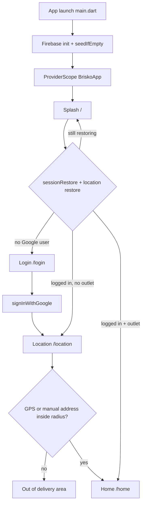
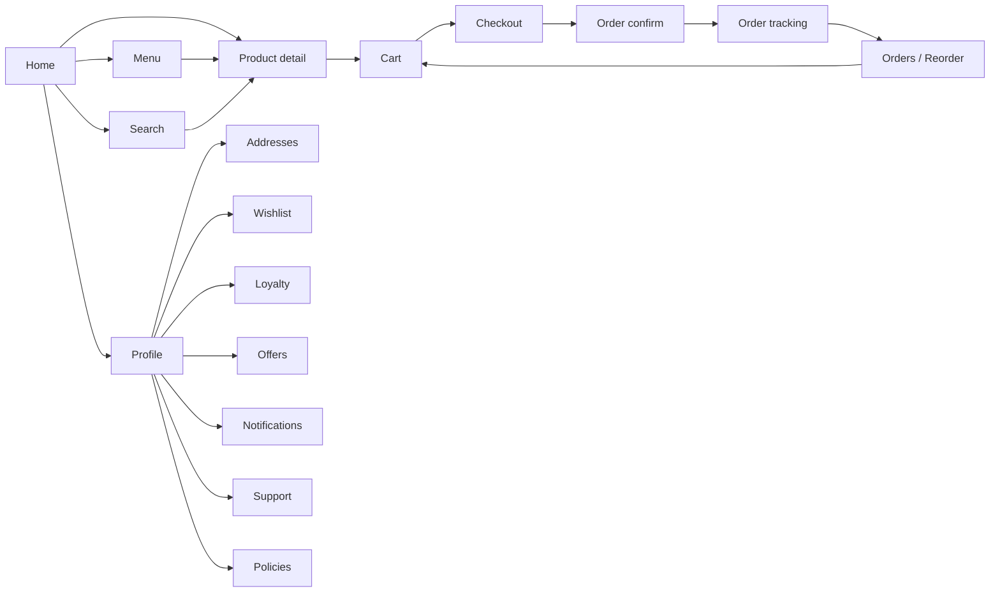

# Brisko Pizza App — Complete Reference

Brisko Pizza is a Flutter food-ordering app. Tagline: **Hot. Fresh. Fast.**

This document covers every screen, reusable widget, theme token, function, data model, service, provider, and the full design / user flow as implemented in the current codebase.

Package: `brisko`
Version: `1.0.0+1`
Entry: `lib/main.dart`
Root widget: `BriskoApp` in `lib/app.dart`

---

## 1. What the app does

A signed-in customer:

1. Continues with Google
2. Detects or enters a delivery location
3. Gets matched to the nearest active outlet inside service radius
4. Browses an outlet-filtered menu
5. Opens product detail, customizes pizza, adds to cart
6. Applies coupon / loyalty points
7. Places a Cash on Delivery order
8. Tracks live status, reorders, rates, and manages profile

Backend is Firebase Auth + Realtime Database + Messaging.
State is Riverpod.
Navigation is go_router.

---

## 2. Tech stack

| Layer | Choice |
|---|---|
| Framework | Flutter, Dart SDK ^3.11.1 |
| State | flutter_riverpod |
| Routing | go_router + StatefulShellRoute tabs |
| Auth | Firebase Auth + Google Sign-In |
| Database | Firebase Realtime Database, persistence on |
| Push | Firebase Messaging + in-app list |
| Location | geolocator + geocoding + haversine |
| Images | cached_network_image |
| Fonts | Google Fonts — Poppins + Inter |
| Icons | Material + hugeicons |
| Animation | lottie for location delivery loop |
| Local cache | shared_preferences |

---

## 3. Folder map

```text
lib/
  main.dart
  app.dart
  firebase_options.dart
  core/
    constants/     AppColors, AppSpacing, AppStrings, api.dart
    theme/         AppTheme, AppMotion
    widgets/       shared UI
    utils/         pricing, geo, phone, formatters
    services/      firebase, location, payment, seed, notification, otp
  features/
    onboarding/    splash
    auth/          login + auth controller
    location/      location screen + outlet matching
    home/          shell + home
    menu/          catalog, cards, filters
    product_detail customize + detail
    search/
    cart/
    checkout/
    orders/        list, confirm, model
    order_tracking/
    profile/       profile + policies
    addresses/
    wishlist/
    notifications/
    loyalty/
    offers_coupons/
    support/
    reviews/
assets/
  images/Brisko_logo.png
  animations/Delivery.json
```

---

## 4. Design flow

### 4.1 Launch and gating



Redirect rules in `routerProvider` (`lib/app.dart`):

- Session restore loading and no user, or location restoring → stay on `/`
- No Firebase user → `/login`
- Logged in on `/login` → `/location`
- Logged in on `/` with no outlet → `/location`
- Logged in on `/` with outlet → `/home`
- Logged in, no outlet, any path except `/location` and `/addresses` → `/location`

Overlay screens wrap with `_OverlayBack`. Hardware back first closes a popup. If none, it goes to `/home`.

### 4.2 Main product loop



### 4.3 Tab shell

`ShellScreen` hosts four indexed branches:

| Index | Label | Route | Screen |
|---|---|---|---|
| 0 | Home | `/home` | HomeScreen |
| 1 | Menu | `/menu` | MenuScreen |
| 2 | Reorder | `/orders` | OrdersScreen |
| 3 | Profile | `/profile` | ProfileScreen |

Floating pill nav (black, rounded, only on Home index 0):
Home, Menu, Reorder, Profile.

`ViewCartChip` sits above the nav whenever cart count > 0.

Back on root tabs: if not Home, go to Home. If already Home, `SystemNavigator.pop()`.

### 4.4 Visual language

- Screen background: white `#FFFFFF` on every screen except the floating black nav
- Home keeps its own collapsing header (logo, location, search). Do not replace it with BriskoTopBar
- Every other titled screen uses `BriskoTopBar`: rounded white card, circular grey back button, centered Poppins title, optional Inter subtitle, optional trailing action
- Cards: 16dp radius, 1px warm border, soft shadow
- Primary CTA: full-width 52dp red gradient, Poppins Bold
- Brand red for prices, badges, primary actions
- Brand black for headers, nav, strong text
- Surface `#F1F1EF` for circular icon buttons
- Page transitions: fade + slight slide. Cart / product / checkout use modal-up

---

## 5. Theme

### 5.1 Colors — `lib/core/constants/app_colors.dart`

| Token | Hex | Use |
|---|---|---|
| primary | `#E30613` | Brand red, CTAs, prices, badges |
| primaryDark | `#B10510` | Gradient end |
| primarySoft | `#FFE8EA` | Soft red fills |
| black | `#111111` | Brand black, nav, titles |
| white | `#FFFFFFFF` | Screen bg, cards, top bar |
| grey | `#F6F4F2` | Neutral fill |
| cream | `#FFF8F3` | Steppers, unread cards |
| warmBg | `#F8F7F3` | Warm cream (legacy) |
| surface | `#F1F1EF` | Circular icon button fill |
| success | `#2E7D32` | Delivered, free delivery |
| successSoft | `#E8F5E9` | Success chips |
| warning | `#F5A623` | Rating stars, preparing |
| warningSoft | `#FFF4E0` | Warning chips |
| text | `#111111` | Body text |
| muted | `#6B6B6B` | Subtitles |
| border | `#E8E4E0` | Card / input borders |
| veg | `#2E7D32` | Veg badge |
| nonVeg | `#E30613` | Non-veg badge |
| overlay | `#99000000` | Sheet barrier |
| shadow | `#24000000` | Soft shadow |
| liveBlue | `#1565C0` | Out for delivery |
| liveBlueSoft | `#E3F2FD` | Live chip fill |

Gradients:

- `primaryGradient` — primary → primaryDark, topLeft to bottomRight
- `headerGradient` — `#111111` → `#1C1C1C` → `#2A0A0C`

Shadow: `AppColors.softShadow` — blur 16, offset (0, 6)

### 5.2 Spacing — `lib/core/constants/app_spacing.dart`

| Token | Value |
|---|---|
| xs | 8 |
| sm | 16 |
| md | 24 |
| lg | 32 |
| card | 16 |
| hero | 24 |
| button | 14 |
| page | 16 |
| section | 24 |

### 5.3 Strings / business constants — `lib/core/constants/app_strings.dart`

| Token | Value |
|---|---|
| appName | Brisko Pizza |
| tagline | Hot. Fresh. Fast. |
| supportPhone | +919876543210 |
| whatsappNumber | 919876543210 |
| gstRate | 0.05 |
| freeDeliveryThreshold | 499.0 |
| flatDeliveryFee | 40.0 |

### 5.4 Typography — `lib/core/theme/app_theme.dart`

Poppins for display / titles / buttons. Inter for body / labels / subtitles.

| Style | Font | Weight | Size |
|---|---|---|---|
| displayLarge | Poppins | 800 | 32 |
| headlineLarge | Poppins | 700 | 26 |
| headlineMedium | Poppins | 700 | 22 |
| titleLarge | Poppins | 700 | 18 |
| titleMedium | Poppins | 600 | 16 |
| bodyLarge | Inter | 400 | 16 / 1.5 |
| bodyMedium | Inter | 400 | 14 / 1.5 |
| labelLarge | Poppins | 600 | 14 |

BriskoTopBar title: Poppins 17 w700 black.
BriskoTopBar subtitle: Inter 12 w400 muted.
BriskoTopBar amount: Poppins 13 w600 primary.

### 5.5 ThemeData extras

- Material 3, light only
- `scaffoldBackgroundColor`: white
- Cards: white, 16 radius, no elevation
- Inputs: filled white, 14 radius, red focus border 1.5
- Elevated buttons: primary, 52 min height, 14 radius
- Outlined buttons: black 1.4 border, 14 radius
- Text buttons: primary
- Bottom nav theme: black bar, selected red, unselected `#BBBBBB`
- Chips: 20 radius, selected primary
- SnackBars: black, floating, 12 radius
- Dialogs: white, 20 radius
- Bottom sheets: transparent with 24 top radius
- FAB: primary

### 5.6 Motion — `lib/core/theme/app_motion.dart`

| Token | Duration |
|---|---|
| micro | 120ms |
| fast | 200ms |
| page | 250ms |
| modal | 280ms |
| step | 600ms |
| heart | 400ms |
| shimmer | 1200ms |
| stagger | 50ms |

Curves: `easeOutCubic`, `easeOutBack`, `elasticOut`.
Reverse duration = 65% of forward.

Page helpers:

- `fadeSlidePage` — fade + slide from Offset(0.08, 0)
- `modalUpPage` — same, from Offset(0, 0.08), used for cart / product / checkout
- Honors `MediaQuery.disableAnimations`

---

## 6. Screens

Every screen uses white `Scaffold` background unless noted. Home keeps its own header. Titled screens use `BriskoTopBar`.

### 6.1 SplashScreen — `/`

File: `lib/features/onboarding/splash_screen.dart`

- White screen, centered logo, app name, tagline
- Fade + scale ~900ms
- Router holds this until auth + location restore finish
- No top bar

### 6.2 LoginScreen — `/login`

File: `lib/features/auth/login_screen.dart`

- Logo, name, tagline, Google CTA
- Only auth method: Continue with Google
- Back is blocked (`SystemNavigator.pop`)
- Empty stubs exist: `register_screen.dart`, `otp_screen.dart`, `forgot_password_screen.dart` (not routed)

### 6.3 LocationScreen — `/location`

File: `lib/features/location/location_screen.dart`

- Detect GPS or type an address
- Lottie delivery animation
- States: loading, detected, no coverage, permission denied, GPS off, failed
- Demo / Connaught Place fallback in matching
- Back: close manual form, else pop, else exit app
- No BriskoTopBar (hero / status UI, not a titled app bar)

### 6.4 ShellScreen

File: `lib/features/home/shell_screen.dart`

- Hosts tab branches
- Floating black pill nav only on Home
- `ViewCartChip` always stacked above nav
- Icons: Home03, Pizza02, replay, person

### 6.5 HomeScreen — `/home`

File: `lib/features/home/home_screen.dart`

**Keep current top bar. Do not use BriskoTopBar.**

Pinned collapsing header:

- Logo + greeting
- Tappable location line
- Search field → `/search`
- Profile shortcut → `/profile`

Body:

- Out of area empty state if `loc.noCoverage`
- Promo PageView: free delivery, BRISKO50, loyalty
- Category chips → `/menu?cat=`
- Best Sellers, Featured, Offers sections
- Pull to refresh invalidates products / categories / coupons
- Outlet-filtered catalog only

### 6.6 MenuScreen — `/menu`

File: `lib/features/menu/menu_screen.dart`

Top bar: title Menu, subtitle Browse the kitchen, back → `/home`

- Horizontal category chips
- `MenuFilterRow`: veg, non-veg, sort sheet
- Sort: popularity, price low/high, rating
- Grid 2-col, or wide list for combos / offers
- Deep link `?cat=`
- Empty / error EmptyState

### 6.7 SearchScreen — `/search`

File: `lib/features/search/search_screen.dart`

Top bar: title Search, subtitle Find your next pizza, trailing close when query not empty

- Search field under the bar (surface fill)
- 220ms debounce
- Matches name, description, category, size, crust, toppings, addons
- No matches → show full outlet menu with a note
- Result count line

### 6.8 ProductDetailScreen — `/product/:id`

File: `lib/features/product_detail/product_detail_screen.dart`

- Image `SliverAppBar` (hero image, not a titled text bar — excluded from BriskoTopBar)
- Wishlist heart in actions
- Veg badge, name, rating, price, description
- Customize chips if product has options
- Reviews tab / last reviews
- Sticky Add to cart or Customize and add
- Opens `CustomizeSheet`

### 6.9 CartScreen — `/cart`

File: `lib/features/cart/cart_screen.dart`

Top bar:

- Title Cart
- Subtitle Review your items / Add something tasty
- Badge = item quantity
- Amount = final rupees when not empty
- Trailing trash → confirm Clear cart
- Back: pop or `/home`

Body:

- EmptyState → Browse menu
- Dismissible lines, quantity stepper, remove
- Coupon field + Apply, green flash on success
- Breakdown: Subtotal, GST 5%, Delivery, Coupon, Loyalty, Total
- Sticky Proceed to Checkout

### 6.10 CheckoutScreen — `/checkout`

File: `lib/features/checkout/checkout_screen.dart`

Top bar: Checkout, Confirm and pay, amount under title

- Delivery address + saved address radios
- Loyalty redeem switch (min points from config)
- Payment: COD live, Online coming soon
- Optional notes accordion
- Price card To pay
- Place Order → writes Firebase, clears cart, `/order-confirm/:id`

### 6.11 OrderConfirmScreen — `/order-confirm/:id`

File: `lib/features/orders/order_confirm_screen.dart`

- Centered success check, order id
- Track order, Back to home
- No titled app bar

### 6.12 OrdersScreen — `/orders`

File: `lib/features/orders/orders_screen.dart`

Top bar: Orders, Reorder your favorites, back → `/home`

- Segment: Previously Ordered / Order History
- Previous: unique items from past orders, Reorder button
- History: order cards → `/order/:id`
- Empty pizza mascot + Explore Menu
- Pull to refresh

### 6.13 OrderTrackingScreen — `/order/:id`

File: `lib/features/order_tracking/order_tracking_screen.dart`

Top bar: Order Tracking, Live status, trailing share copies order id

- Header card: id, amount, payment, StatusChip
- Vertical stepper: placed → confirmed → preparing → ready → on the way → delivered
- Cancelled state
- Address, expandable items + invoice
- Cancel if `canCancel` (placed / confirmed)
- Reorder replaces cart
- Rate and review after delivered

### 6.14 ProfileScreen — `/profile`

File: `lib/features/profile/profile_screen.dart`

Top bar: Profile, Your Brisko account, trailing edit, back → `/home`

- Avatar initial, name, email, phone, loyalty pts
- Tiles: Addresses, Wishlist, Loyalty, Offers, Notifications, Support, Policies
- Logout confirm dialog
- Edit dialog: name, email, phone

### 6.15 AddressesScreen — `/addresses`

File: `lib/features/addresses/addresses_screen.dart`

Top bar: Addresses, Delivery locations, trailing add

- List of saved addresses, Default chip
- Tap sets location + outlet and pops
- Menu: edit, set default, delete
- Glass sheet add/edit: label, full address, lat, lng
- FAB add

### 6.16 WishlistScreen — `/wishlist`

File: `lib/features/wishlist/wishlist_screen.dart`

Top bar: Wishlist, Saved for later, badge = count

- 2-col ProductCard grid
- EmptyState if none

### 6.17 LoyaltyScreen — `/loyalty`

File: `lib/features/loyalty/loyalty_screen.dart`

Top bar: Loyalty, Earn on every order

- Dark gradient balance card, animated points
- Earned / redeemed totals
- History list + / − entries

### 6.18 OffersScreen — `/offers`

File: `lib/features/offers_coupons/offers_screen.dart`

Top bar: Offers, Coupons and deals

- Coupon cards: code, description, min order, Copy

### 6.19 NotificationsScreen — `/notifications`

File: `lib/features/notifications/notifications_screen.dart`

Top bar: Notifications, unread badge, subtitle caught up vs Latest updates

- Unread cream cards
- Tap marks read, opens order if `orderId` set

### 6.20 SupportScreen — `/support`

File: `lib/features/support/support_screen.dart`

Top bar: Support, We are here to help

- WhatsApp and Call tiles
- Ticket form: complaint / query / feedback → `supportTickets/{id}`

### 6.21 PoliciesScreen — `/policies`

File: `lib/features/profile/policies_screen.dart`

Top bar: Policies, How Brisko works

- Privacy, Terms, Refund and Cancellation cards

### 6.22 Screens that are not titled app-bar pages

| Screen | Why excluded from BriskoTopBar |
|---|---|
| HomeScreen | Custom collapsing header |
| SplashScreen | Brand splash, no title bar |
| LoginScreen | Auth hero, no title bar |
| LocationScreen | Status / detect UI |
| OrderConfirmScreen | Success state, no title bar |
| ProductDetailScreen | Image SliverAppBar |
| CustomizeSheet | Modal sheet |
| ReviewSheet | Modal sheet |

---

## 7. Shared widgets

All under `lib/core/widgets/` unless noted.

### 7.1 BriskoTopBar

File: `lib/core/widgets/brisko_top_bar.dart`

Reusable titled header for every non-Home titled screen.

```dart
BriskoTopBar({
  required String title,
  String? subtitle,
  bool showBack = true,
  VoidCallback? onBack,
  IconData? trailingIcon,
  VoidCallback? onTrailingTap,
  int? badgeCount,
  String? amountText,
})
```

Layout:

- Safe-area top + 8, horizontal 16
- 60dp white rounded 16 card, thin border, light shadow
- Left: 44 tap target, 36 circle `#F1F1EF`, 20dp black back arrow
- Center: title + optional badge. Amount (red) wins over subtitle
- Right: optional circular action, or 44 spacer for balance
- Default back: `canPop` then pop, else `/home`

Where it is used:

| Screen | title | subtitle | extra |
|---|---|---|---|
| Menu | Menu | Browse the kitchen | onBack home |
| Search | Search | Find your next pizza | close when query |
| Cart | Cart | Review your items | badge, amount, trash |
| Checkout | Checkout | Confirm and pay | amount |
| Orders | Orders | Reorder your favorites | onBack home |
| Order tracking | Order Tracking | Live status | share |
| Profile | Profile | Your Brisko account | edit, onBack home |
| Wishlist | Wishlist | Saved for later | badge |
| Notifications | Notifications | dynamic | unread badge |
| Loyalty | Loyalty | Earn on every order | |
| Support | Support | We are here to help | |
| Addresses | Addresses | Delivery locations | add |
| Offers | Offers | Coupons and deals | |
| Policies | Policies | How Brisko works | |

### 7.2 AppCard

Rounded 16 white card, border, soft shadow, optional selected red border, optional InkWell.

### 7.3 PrimaryButton

Full width 52, red gradient, Poppins 16 w700, press scale 0.97, loading spinner, optional icon, disabled opacity 0.45.

### 7.4 EmptyState

Centered bobbing icon or pizza painter, title, muted subtitle, optional CTA.

### 7.5 StatusChip

Maps order status to color. Live pulse dot for preparing / ready / out_for_delivery.

### 7.6 VegBadge

16 square, green or red border + inner dot. Semantics vegetarian / non vegetarian.

### 7.7 QuantityStepper

Cream bordered row, minus / animated value / plus. Compact 40 or 44.

### 7.8 PriceRow

Label left, value right. Bold total, optional valueColor, highlight flash for coupon.

### 7.9 PizzaLoader

Rotating pizza slice + message.

### 7.10 GlassSheet — `showGlassSheet`

Blur 14 modal sheet, white 0.92 overlay, 24 top radius, scale-in.

### 7.11 FadeSlideIn

Delayed fade + slide for home sections.

### 7.12 Skeleton / ProductCardSkeleton

Shimmer bars for loading grids.

### 7.13 BriskoRefresh / BriskoRefreshSpinner

RefreshIndicator wrapper + rotating pizza.

### 7.14 PressableScale

Pointer-driven scale to 0.97.

### 7.15 BriskoLogo / PizzaSlicePainter

Asset `assets/images/Brisko_logo.png`, fallback painted slice.

### 7.16 SectionHeader

Title + See all text button with chevron nudge.

### 7.17 Feature widgets (not in core/widgets)

| Widget | File | Role |
|---|---|---|
| ProductCard | `features/menu/product_card.dart` | Grid/wide card, veg, price, add, hero image |
| MenuFilterRow | `features/menu/menu_filter_row.dart` | Veg / non-veg / sort |
| CategoryIcon | `features/menu/category_icon.dart` | Category icon map |
| ViewCartChip | `features/cart/view_cart_chip.dart` | Floating View cart pill |
| CustomizeSheet | `features/product_detail/customize_sheet.dart` | Size, crust, toppings, addons, qty |
| ReviewSheet | `features/reviews/review_sheet.dart` | Star + text review |

---

## 8. Functions, services, utils

### 8.1 App bootstrap — `lib/main.dart`

`main()`:

1. `WidgetsFlutterBinding.ensureInitialized()`
2. `Firebase.initializeApp`
3. Web: Auth `Persistence.LOCAL`
4. RTDB persistence enabled
5. `SeedService().seedIfEmpty()` fire-and-forget
6. `runApp(ProviderScope(child: BriskoApp()))`

### 8.2 Routing — `lib/app.dart`

- `routerProvider` — GoRouter with redirect
- `_RouterRefresh` — ping on auth / session / location change
- `_OverlayBack` — popup-aware back to home
- `BriskoApp` — MaterialApp.router, `AppTheme.light`

Routes:

| Path | Page |
|---|---|
| `/` | SplashScreen |
| `/login` | LoginScreen |
| `/location` | LocationScreen |
| `/home` | HomeScreen (shell) |
| `/menu` | MenuScreen (shell) |
| `/orders` | OrdersScreen (shell) |
| `/profile` | ProfileScreen (shell) |
| `/cart` | CartScreen |
| `/search` | SearchScreen |
| `/product/:id` | ProductDetailScreen |
| `/checkout` | CheckoutScreen |
| `/order-confirm/:id` | OrderConfirmScreen |
| `/order/:id` | OrderTrackingScreen |
| `/addresses` | AddressesScreen |
| `/wishlist` | WishlistScreen |
| `/loyalty` | LoyaltyScreen |
| `/offers` | OffersScreen |
| `/notifications` | NotificationsScreen |
| `/support` | SupportScreen |
| `/policies` | PoliciesScreen |

### 8.3 Formatters — `lib/core/utils/formatters.dart`

- `inr` — `Rs ` 0 decimals, en_IN
- `inrExact` — 2 decimals
- `rupees(num)` — 0 decimals if whole, else 2

### 8.4 Geo — `lib/core/utils/geo.dart`

- `haversineKm(lat1, lng1, lat2, lng2)` — Earth 6371 km
- `_toRad`

### 8.5 Phone — `lib/core/utils/phone.dart`

`PhoneUtil`:

- `digits` — strip non-digits
- `normalize` — 10 digit → 91xxxxxxxxxx
- `isValidIndianMobile` — `^91[6-9]\d{9}$`
- `e164` — +prefix
- `display`

### 8.6 Pricing — `lib/core/utils/pricing.dart`

`Pricing.itemPrice` = base + size + crust + toppings + addons.

`Pricing.compute` returns `PriceBreakdown`:

- subtotal = sum of line totals
- gstAmount = 5% of subtotal
- deliveryCharge = 0 if subtotal >= 499 else 40
- coupon: valid now, min order, first-order flag, usage cap, flat or percent, maxDiscount
- loyalty: if redeem and points >= min, cap by config / balance / remaining amount
- finalAmount floored at 0

### 8.7 FirebaseService — `lib/core/services/firebase_service.dart`

Singleton: `auth`, `db`, `ref(path)`, `enablePersistence()`.

### 8.8 LocationService — `lib/core/services/location_service.dart`

- `detect()` — GPS, permission, reverse geocode
- `fromAddress(query)`
- `openSettings()` / `openGpsSettings()`
- Failures: denied, deniedForever, gpsOff, failed

### 8.9 PaymentService — `lib/core/services/payment_service.dart`

- `CodPaymentGateway` → success pending
- `MockPaymentGateway` → unavailable, coming soon
- `gatewayFor(method)`

### 8.10 SeedService — `lib/core/services/seed_service.dart`

If `categories` empty, writes outlets, categories, products, coupons, loyaltyConfig.
Also `repairCategoryImages()`.

Seeded outlets:

- Brisko Connaught Place, New Delhi `28.6328, 77.2197` radius 25 km
- Brisko Bandra, Mumbai `19.0596, 72.8295` radius 25 km
- Hours 11:00–23:30

Seeded coupons:

| Code | Offer |
|---|---|
| BRISKO50 | Flat Rs 50 off above 299 |
| FIRST100 | Rs 100 first order above 399 |
| PIZZA20 | 20% off up to 120, min 249 |

### 8.11 NotificationService — `lib/core/services/notification_service.dart`

Request permission, store FCM token at `users/{uid}/fcmTokens/{token}`.

### 8.12 AuthController — `lib/features/auth/auth_controller.dart`

- `signInWithGoogle`
- `_ensureUserRecord`
- `restoreSession`
- `updateProfile`
- `logout` — Google + Firebase + prefs flag, clear location

Providers:

- `authStateProvider`
- `sessionRestoreProvider` (min ~900ms splash)
- `currentUserProvider`
- `authControllerProvider`

### 8.13 LocationController — `lib/features/location/location_controller.dart`

- Detect / manual / saved address
- Match nearest active outlet via haversine vs `serviceRadiusKm`
- Persist last location in SharedPreferences
- `noCoverage` when outside all radii
- `clearForNewLogin`

### 8.14 CartController — `lib/features/cart/cart_controller.dart`

Firebase `users/{uid}/cart/{id}`

- `add` / `addCustomized` (new UUID line, no merge)
- `setQuantity` (0 removes)
- `remove` / `clear` / `replaceAll`

Providers: `cartProvider`, `cartCountProvider`, `priceBreakdownProvider`, `appliedCouponProvider`, `redeemLoyaltyProvider`, `loyaltyConfigProvider`, `userOrderCountProvider`

### 8.15 OrdersController — `lib/features/orders/orders_controller.dart`

`placeOrder`:

1. Validate login, cart, amount
2. Id `ORD{timestamp}`
3. Pay via gateway
4. Write `orders/{id}`, `userOrders/{uid}/{id}`, `outletOrders/{outletId}/{id}`
5. Clear cart, coupon, loyalty toggle

`cancel` if still placed/confirmed.

Providers: `userOrdersProvider`, `orderByIdProvider`

### 8.16 AddressController

Save / delete / setDefault on `users/{uid}/addresses`.

### 8.17 WishlistController

Toggle product id set under user wishlist.

### 8.18 CouponController / applyCouponProvider

Validate code against coupons node + usage.

### 8.19 LoyaltyController

History stream `users/{uid}/loyaltyHistory`.

### 8.20 NotificationsController

`markRead` sets `isRead`. `unreadCountProvider`.

### 8.21 ReviewsController + ReviewSheet

Write review, used after delivered.

### 8.22 Catalog providers — `lib/features/menu/catalog_providers.dart`

- `categoriesProvider` — active, sortOrder
- `productsProvider` — active products
- `productByIdProvider(id)`

### 8.23 ProductModel helpers

- `image` — first image
- `hasCustomizations`
- `availableAt(outletId)` — empty outlet list = all, else must contain id

---

## 9. Data models

| Model | File | Main fields |
|---|---|---|
| UserModel | `features/profile/user_model.dart` | uid, name, email, phone, loyaltyPoints, role, fcmTokens |
| AddressModel | `features/addresses/address_model.dart` | label, fullAddress, lat, lng, outletId, isDefault |
| OutletModel | `features/location/outlet_model.dart` | name, lat/lng, serviceRadiusKm, hours, contact |
| CategoryModel | `features/menu/category_model.dart` | name, sortOrder, isActive, image |
| ProductModel | `features/menu/product_model.dart` | prices, veg, sizes/crusts/toppings/addons, ratings, outletIds |
| CustomOption | same | id, name, price |
| CartItem | `features/cart/cart_item.dart` | customization maps, qty, unit/total |
| CouponModel | `features/offers_coupons/coupon_model.dart` | type, value, min, max, window, first-order |
| OrderModel | `features/orders/order_model.dart` | items, totals, status, timestamps, invoiceUrl |
| LoyaltyConfig | `features/loyalty/loyalty_config.dart` | earn rate, redeem value, min 50, max 200/order, 90 day |
| LoyaltyEntry | same | earned, redeemed, balanceAfter |
| NotificationModel | `features/notifications/notification_model.dart` | title, body, isRead, orderId |
| ReviewModel | `features/reviews/review_model.dart` | rating, text, user |

Order statuses:

`placed` → `confirmed` → `preparing` → `ready` → `out_for_delivery` → `delivered` / `cancelled`

Cancel only while placed or confirmed.

Default loyalty:

- 0.05 points per rupee
- 1 pt = Rs 1
- Min redeem 50
- Max 200 pts / order
- Expiry 90 days

---

## 10. Firebase paths

| Path | Data |
|---|---|
| `users/{uid}` | profile |
| `users/{uid}/cart/{id}` | cart lines |
| `users/{uid}/addresses/{id}` | addresses |
| `users/{uid}/wishlist` | product ids |
| `users/{uid}/notifications/{id}` | inbox |
| `users/{uid}/loyaltyHistory/{id}` | points ledger |
| `users/{uid}/fcmTokens/{token}` | push |
| `categories` | menu groups |
| `products` | catalog |
| `outlets` | kitchens |
| `coupons/{CODE}` | offers |
| `loyaltyConfig` | points rules |
| `orders/{orderId}` | full order |
| `userOrders/{uid}/{orderId}` | index |
| `outletOrders/{outletId}/{orderId}` | kitchen index |
| `supportTickets/{id}` | tickets |
| `reviews/{productId}/...` | ratings |

---

## 11. Screen-by-screen design tokens in use

| Area | Background | Header | Accent |
|---|---|---|---|
| All scaffolds | `#FFFFFF` | — | — |
| Home header | custom collapsing | logo / location / search | red CTA in body |
| Titled screens | `#FFFFFF` | BriskoTopBar white card | red badge / amount |
| Nav pill | `#111111` | — | selected `#E30613` |
| View cart chip | `#E30613` | white count badge | — |
| Cards | `#FFFFFF` | 16 radius | border `#E8E4E0` |
| Icon circles | `#F1F1EF` | 20dp icon | black |
| Count badge | `#E30613` | white Poppins bold | — |
| Success | `#E8F5E9` / `#2E7D32` | — | — |
| Loyalty hero | headerGradient | white pts | — |

Top bar sizing:

- Height 56–64 (implemented 60)
- Corner 14–20 (implemented 16)
- Icon 20, hit 44
- Horizontal padding 16

---

## 12. Typical user journey (design + logic)

1. Splash holds ~900ms while session + last outlet restore
2. New user: Login Google → Location detect → Home
3. Returning user with saved outlet: Splash → Home
4. Home: change location, search, open category, tap product
5. Product: wishlist, customize, add
6. View cart chip appears → Cart
7. Apply coupon, see GST / delivery / total
8. Checkout: address, optional loyalty, COD, notes, Place Order
9. Confirm → Tracking stepper live from RTDB
10. After delivery: review, loyalty credit, reorder from Orders tab
11. Profile: addresses, offers, support ticket, policies, logout

---

## 13. Implementation notes

- One parameterized `BriskoTopBar`. Screens only pass the props they need
- Home header is intentionally unique
- Product detail keeps image SliverAppBar
- Search uses BriskoTopBar plus a separate field (search is not a flat Material title)
- Overlay routes force home on system back after sheets close
- Cart customizations never merge: each add gets a new UUID
- Online pay is mocked; COD is the live path
- `lib/core/constants/api.dart` is empty
- Auth register / OTP / forgot files are empty and unused

This file matches the current tree under `lib/` after the white-background and shared top-bar pass.
